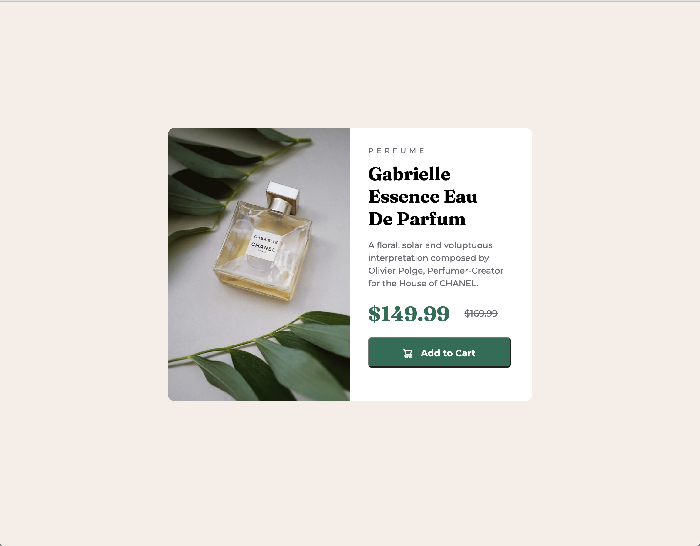

# Frontend Mentor - Product preview card component solution

This is a solution to the [Product preview card component challenge on Frontend Mentor](https://www.frontendmentor.io/challenges/product-preview-card-component-GO7UmttRfa). Frontend Mentor challenges help you improve your coding skills by building realistic projects. 

## Table of contents

- [Overview](#overview)
  - [The challenge](#the-challenge)
  - [Screenshot](#screenshot)
  - [Links](#links)
- [My process](#my-process)
  - [Built with](#built-with)
  - [What I learned](#what-i-learned)
  - [Continued development](#continued-development)
- [Author](#author)

## Overview

### The challenge

Users should be able to:

- View the optimal layout depending on their device's screen size
- See hover and focus states for interactive elements

### Screenshot

### Links

- Solution URL: [Add solution URL here](https://your-solution-url.com)
- Live Site URL: [Add live site URL here](https://your-live-site-url.com)

## My process

### Built with

- Semantic HTML5 markup
- CSS custom properties
- Mobile-first workflow

### What I learned

This was my first time coding a site using mobile-first design. I initially used an img tag for the big photo but found trouble when I had to change it to a different file for the desktop version. I ended up converting it to a div tag and used the CSS 'background' property to set the image url, both initally and then in my media query for the larger size.

### Continued development

I'm starting to understand how to better use classes to repeat styles without having to repeat code but there's still room for improvement!

## Author

- Frontend Mentor - [@chelc315](https://www.frontendmentor.io/profile/chelc315)